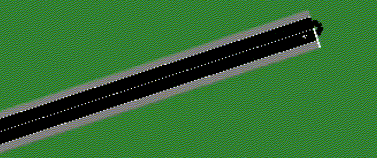

# ELCA-Challenge: Bus To Green Aarhus
This is the repository for the PolyHack Hackathon 2020 of the team "bus to green aarhus"

# [WatchMe](https://youtu.be/NpEaa2P7qZI)
First and foremost, you should enjoy our "WatchMe" of this repository. A short and fun summary of our adventures with Aarhus that outlines the essence of this project in a concise and witty manner:  

# WebApp
We decided the best way to show the magnitude of the problem is through an interactive Web App, where we show our results. This can be found at https://aarhus-mobility.herokuapp.com/

## Files
## [simulation.py](simulation.py)
This is the heart of our project, the agent that steers the buses around the streets of Aarhus. There are a few important classes necessary to understand our code:
- `_BaseSimulation`: This is the base class for a simulation, which contains boilerplate code that we did not want to rewrite for every agent. Every simulation instance inherit the functionality of this class.
- `_StageScorer`: This is the tool we used to evaluate our agents. It produces an estimated score for each of the three evaluation stages. It does this by linking itself into the every simulation step, from where the different metrics can be evaluated.
- `ExampleSimulation`: This is the simulation that was given to us as an Example by ELCA, rewritten to mach our class format. It was a good way for having a first Idea of how to interact with SUMO.
- `BusJob`: Our buses can have a queue of tasks(=jobs), that they perform. This is the base class for such a task, which is implemented by the following tasks
- `MoveTo`: This moves the bus to a given edge at a given position. It is "smart" in a way that it can also go to locations that are not downstream of the current location by rerouting the bus around corners and dead ends.  

- `IDLE`: This tells our bus to park on the side of the road. That way the bus does not produce any emissions and cars can still pass. We do that whenever we don't have anything else to do and it is also used to wait at passengers departure position in advance to reduce waiting times.

- `DropOff`: This drops a passenger off if the bus is at the correct location and a passenger is on the bus.
- `PickUp`: This will pick up a passenger at the given location by indicating that we are going to stop where he wants to go.
- `Bus`: This is our wrapper for the bus functionality and it manages the bus jobs discussed before.

All of this leads us to our two agents:
- `FixedNBusesSimulation`: This sends a fixed number of buses onto the street, which will then go and pickup passengers sorted by their departure times. When there are no passengers to transport the bus will idle by parking by the street.
- `OptimizedFixedNBusesSimulation`: Which is our final solution, which uses the same strategy as our agent described before, but it chooses its next passenger smarter by considering the distance to the next passenger and accounting for the time it takes to drive to these passengers vs the time they will spawn.

## Evaluation
### [main.py](main.py)
This is the normal main.py file that was provided by ELCA. It is just slightly adapted to run on other operating systems

### [quicktests.py](quicktests.py)
This is a script that tests our submission on a small scaled random network. This was very helpful for quick evaluation 
This is a little test project I created that generates random cityscapes with car and passenger traffic. This might help as a "clean" benchmark for measuring our algorithms performance.

### [slowtests.py](quicktests.py)
This is a script that tests our submission on the full Aarhus map, while still running our evaluation and returning a nice score.

## Results
A collection of our results and measurements can be found in the [results](results) folder. They are the not quite polished versions of our tests, of which we show a best-of in our **WatchMe** video.

  
*The distribution of passenger statuses, from which we can see how the average waiting time was even slightly lower than the riding time, which is another indication of our fast pickups, which are possible through our agents anticipating the location of future passengers, which allows for faster pickup times*

  
*The occupancy of our buses on a test with 48 instances. Note that our optimal solution only uses 28 agents, which in turn have a much higher occupancy.*

